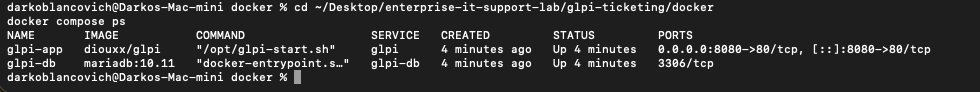
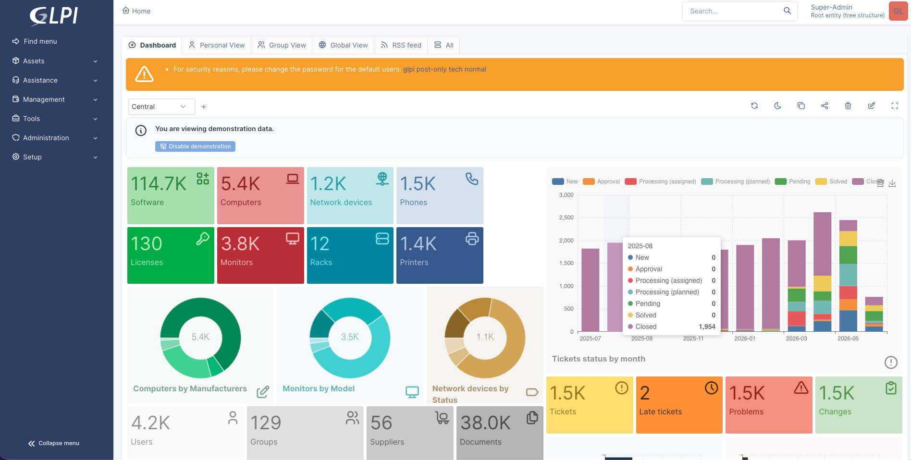
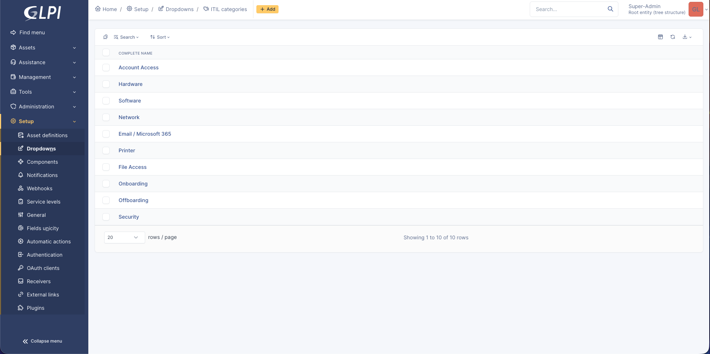
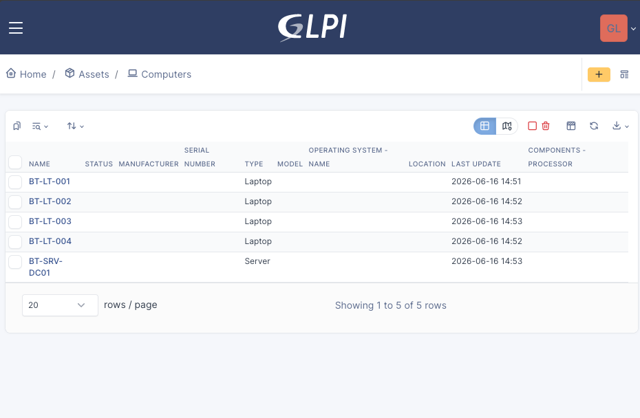
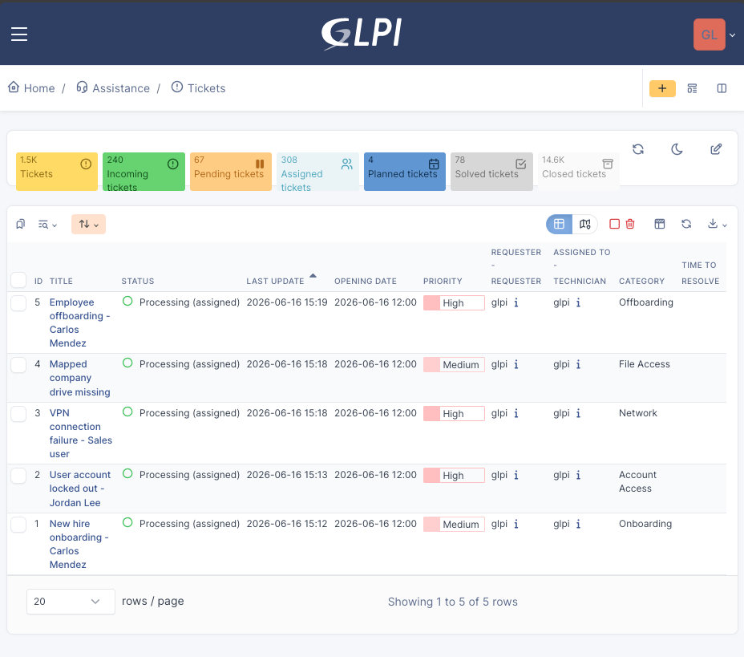

# GLPI Ticketing and ITSM Setup

## Overview

This section documents the GLPI ticketing and IT service management phase of the BlancoTech Solutions IT lab.

GLPI was deployed locally using Docker Desktop to validate ticketing workflows, asset tracking, ticket categorization, and help desk process documentation.

The original cloud deployment plan was to host GLPI on Oracle Cloud Infrastructure using an Always Free Ampere A1 instance. The Oracle Cloud VCN, public subnet, SSH keys, and Resource Manager/Terraform stack were prepared, but the instance could not be launched because Oracle returned an `Out of host capacity` error for `VM.Standard.A1.Flex` in the selected San Jose availability domain.

To keep the project moving, GLPI was deployed locally using Docker while keeping the Oracle Cloud deployment stack available for future retry.

## Deployment Summary

| Item | Configuration |
|---|---|
| Application | GLPI |
| Deployment method | Docker Compose |
| Host system | Mac mini M1 |
| Access URL | `http://localhost:8080` |
| Web container | `glpi-app` |
| Database container | `glpi-db` |
| Database engine | MariaDB 10.11 |
| Database name | `glpidb` |
| Docker Compose path | `glpi-ticketing/docker/docker-compose.yml` |
| Environment file | `glpi-ticketing/docker/.env` |
| Safe example file | `glpi-ticketing/docker/.env.example` |

## Cloud Deployment Note

Oracle Cloud was prepared for the planned GLPI deployment.

Prepared Oracle resources:

- Oracle Cloud account
- Region: US West / San Jose
- VCN: `vcn-blancotech-glpi`
- Public subnet: `public subnet-vcn-blancotech-glpi`
- Private subnet: `private subnet-vcn-blancotech-glpi`
- Internet gateway
- NAT gateway
- Service gateway
- SSH key pair
- Resource Manager / Terraform stack: `stack-bt-glpi01`

The saved stack attempted to create:

| Field | Value |
|---|---|
| Instance name | `vm-bt-glpi01` |
| Shape | `VM.Standard.A1.Flex` |
| OCPU | `1` |
| Memory | `6 GB` |
| Image | Canonical Ubuntu 22.04 Minimal aarch64 |
| Public IPv4 | Enabled |
| VNIC | `vnic-bt-glpi01-primary` |

The deployment could not continue because OCI returned:

```text
Error: 500-InternalError, Out of host capacity.
```

The local Docker deployment was used as the validation environment for the GLPI phase.

## Docker Compose Setup

The Docker Compose setup runs two services:

| Service | Purpose |
|---|---|
| `glpi-app` | GLPI web application |
| `glpi-db` | MariaDB database backend |

The `.env` file stores local database credentials and is excluded from GitHub using `.gitignore`.

The `.env.example` file is committed to show the required variables without exposing local credentials.

## Docker Commands Used

Start GLPI:

```bash
cd glpi-ticketing/docker
docker compose up -d
```

Check container status:

```bash
docker compose ps
```

Stop GLPI:

```bash
cd glpi-ticketing/docker
docker compose down
```

View logs:

```bash
cd glpi-ticketing/docker
docker compose logs
```

## Docker Validation

Both containers were successfully started.

Validated containers:

| Container | Image | Purpose |
|---|---|---|
| `glpi-app` | `diouxx/glpi` | GLPI web interface |
| `glpi-db` | `mariadb:10.11` | GLPI database |

Because the Mac mini uses Apple Silicon, the GLPI container was configured to run using the `linux/amd64` platform to resolve ARM64 image compatibility issues.

Screenshot:



## GLPI Dashboard Validation

GLPI was successfully installed and accessed through:

```text
http://localhost:8080
```

The GLPI dashboard was reached after completing the web installer and database connection process.

Screenshot:



## Purpose of GLPI in This Lab

GLPI is used to demonstrate IT support operations for a simulated 75-user hybrid company.

This phase demonstrates:

- Ticket intake
- Incident management
- Service request handling
- Ticket categorization
- Priority assignment
- Asset inventory tracking
- Support workflow documentation
- Escalation planning
- Help desk process design
- ITSM documentation

## BlancoTech Support Model

BlancoTech Solutions is modeled as a 75-user hybrid company with the following departments:

- HR
- Finance
- Sales
- Operations
- IT

Support roles:

| Role | Responsibility |
|---|---|
| Help Desk Technician | First-line troubleshooting, password resets, basic user support, ticket triage |
| IT Support Analyst | Escalated troubleshooting, account access, workstation support, documentation |
| Systems Administrator | AD, DNS, GPO, server, automation, and infrastructure support |
| IT Manager | Prioritization, approvals, reporting, and process ownership |

## Ticket Categories

The following GLPI ticket categories were created:

| Category | Purpose |
|---|---|
| Account Access | Password resets, account lockouts, MFA, sign-in issues |
| Hardware | Laptop, monitor, docking station, and peripheral issues |
| Software | Application errors, installs, updates, and licensing |
| Network | Internet, Wi-Fi, DNS, and VPN troubleshooting |
| Email / Microsoft 365 | Outlook, Teams, mailbox, and collaboration issues |
| Printer | Printer offline, print queue, and driver issues |
| File Access | Shared folders, permissions, and mapped drives |
| Onboarding | New hire IT setup |
| Offboarding | Account disablement and access removal |
| Security | Suspicious emails, lost devices, and access concerns |

Screenshot:



## Priority Model

The lab uses a simple help desk priority model.

| Priority | Description | Example |
|---|---|---|
| Low | Minor request or question | General software question |
| Medium | User impacted but workaround exists | Printer issue or mapped drive issue |
| High | User blocked from critical work | VPN failure, account lockout, offboarding |
| Critical | Multiple users or business function affected | Department-wide outage |

## Sample Assets

The following sample assets were created in GLPI:

| Asset Name | Type | Purpose |
|---|---|---|
| `BT-LT-001` | Laptop | Elena Torres / HR Manager |
| `BT-LT-002` | Laptop | Maria Gonzalez / Sales Manager |
| `BT-LT-003` | Laptop | Priya Shah / Finance Manager |
| `BT-LT-004` | Laptop | Alan Chen / IT Support Analyst |
| `BT-SRV-DC01` | Server | Windows Server domain controller for `blancotech.local` |

Screenshot:



## Sample Tickets

Five sample tickets were created to connect GLPI ticketing workflows to the Active Directory, Group Policy, and PowerShell work already completed in the lab.

## Ticket 1: New Hire Onboarding

| Field | Value |
|---|---|
| Title | New hire onboarding - Carlos Mendez |
| Type | Request |
| Category | Onboarding |
| Priority | Medium |

Description:

```text
Create Active Directory account for Carlos Mendez, assign Sales department access, add VPN access, assign manager Maria Gonzalez, and prepare laptop assignment. Created user cmendez using PowerShell onboarding script. Assigned All-Employees, Sales-Users, and VPN-Users groups. Manager set to Maria Gonzalez. Account configured to require password change at next logon.
```

Skills demonstrated:

- New hire request handling
- AD account provisioning
- Group-based access assignment
- PowerShell onboarding automation
- Ticket documentation

## Ticket 2: Account Locked Out

| Field | Value |
|---|---|
| Title | User account locked out - Jordan Lee |
| Type | Incident |
| Category | Account Access |
| Priority | High |

Description:

```text
User reports they cannot sign in. Error indicates the account may be locked after multiple failed password attempts. Checked locked-out users using PowerShell account lockout script. No domain-wide lockout issue found. Verified account status and documented account troubleshooting workflow.
```

Skills demonstrated:

- Help desk account troubleshooting
- Account lockout workflow
- PowerShell validation
- Incident documentation

## Ticket 3: VPN Connection Failure

| Field | Value |
|---|---|
| Title | VPN connection failure - Sales user |
| Type | Incident |
| Category | Network |
| Priority | High |

Description:

```text
Sales user cannot connect to VPN while working remotely. User needs access to internal company resources. Verified VPN group membership in Active Directory. Confirmed user should be a member of VPN-Users. Documented escalation path for network and VPN troubleshooting.
```

Skills demonstrated:

- VPN support workflow
- Group membership validation
- Remote user support
- Network escalation process

## Ticket 4: Mapped Company Drive Missing

| Field | Value |
|---|---|
| Title | Mapped company drive missing |
| Type | Incident |
| Category | File Access |
| Priority | Medium |

Description:

```text
User reports the company shared drive is not appearing after login. Reviewed mapped drive Group Policy configuration. Confirmed Company Drive maps to \\vm-bt-dc01\Company using drive letter S:. Documented GPO-based remediation steps.
```

Skills demonstrated:

- File access troubleshooting
- Group Policy validation
- Mapped drive support
- Windows user support documentation

## Ticket 5: Employee Offboarding

| Field | Value |
|---|---|
| Title | Employee offboarding - Carlos Mendez |
| Type | Request |
| Category | Offboarding |
| Priority | High |

Description:

```text
Disable user account, remove group memberships, clear manager field, update description with ticket reference, and move account to Disabled Users OU. Completed offboarding using PowerShell offboarding script. Disabled account cmendez, removed group memberships except Domain Users, cleared manager attribute, updated description, and moved account to Disabled Users OU.
```

Skills demonstrated:

- Offboarding workflow
- Account disablement
- Group cleanup
- PowerShell offboarding automation
- Audit-friendly documentation

Screenshot:



## Integration With Previous Lab Work

This GLPI phase connects directly to earlier project phases.

| Previous Phase | GLPI Connection |
|---|---|
| Active Directory | Tickets reference AD users, groups, onboarding, and offboarding |
| Group Policy | Tickets reference mapped drives and workstation policies |
| PowerShell | Tickets reference onboarding, offboarding, reporting, and lockout scripts |
| DNS / Networking | Tickets reference VPN, DNS, and connectivity troubleshooting |
| Security Baseline | Tickets support access control, offboarding, and incident documentation |
| Asset Management | GLPI tracks sample laptops and server assets |

## Evidence Captured

| Evidence | Screenshot |
|---|---|
| Docker containers running | `screenshots/glpi-docker-containers-running.png` |
| GLPI dashboard | `screenshots/glpi-dashboard.png` |
| Ticket categories | `screenshots/glpi-ticket-categories.png` |
| Sample assets | `screenshots/glpi-sample-assets.png` |
| Sample tickets | `screenshots/glpi-sample-tickets.png` |

## Skills Demonstrated

This GLPI phase demonstrates:

- GLPI ticketing setup
- Docker Compose deployment
- MariaDB-backed application deployment
- Local container troubleshooting
- ITSM workflow design
- Ticket category planning
- Priority handling
- Incident documentation
- Service request documentation
- Asset inventory tracking
- Help desk process design
- Support escalation documentation
- GitHub evidence management

## Production Considerations

This GLPI deployment is designed for lab validation.

A production GLPI deployment would require additional controls:

- HTTPS/TLS
- Secure database credentials
- Reverse proxy
- Email-to-ticket integration
- LDAP or SSO authentication
- Scheduled backups
- Access control review
- Monitoring
- Patch management
- Hardened firewall rules
- Production-grade database storage

## Final Validation Summary

The GLPI phase validates that the lab can support a realistic help desk workflow.

Completed GLPI deliverables:

- Docker Compose GLPI deployment
- MariaDB database container
- GLPI dashboard access
- Ticket categories
- Sample asset inventory
- Five realistic IT support tickets
- Screenshot-backed evidence
- GitHub documentation

This phase strengthens the project by showing not only system administration skills, but also the operational workflow used by IT support teams to receive, document, prioritize, and resolve user issues.