# PowerShell Automation

## Overview

This section contains PowerShell scripts created for the BlancoTech Solutions IT lab.

The goal is to demonstrate practical automation for Active Directory administration, account lifecycle management, reporting, access review, account troubleshooting, and network diagnostics.

These scripts are designed to be tested against the `blancotech.local` Active Directory environment hosted on the Windows Server domain controller.

## Environment

| Item | Configuration |
|---|---|
| Domain | blancotech.local |
| Domain Controller | vm-bt-dc01 |
| Server OS | Windows Server 2025 Datacenter |
| Script Location | powershell/ |
| Test Location | Windows Server VM |
| Required Module | ActiveDirectory PowerShell module |
| Log Directory | C:\Logs |
| Report Directory | C:\Reports |

## Script Inventory

| Script | Purpose |
|---|---|
| Create-NewHireUser.ps1 | Creates a new AD user, assigns OU placement, groups, manager, VPN access, and logs actions |
| Disable-OffboardedUser.ps1 | Disables an AD user, removes group memberships, clears manager, updates description, moves account to Disabled Users OU |
| Export-ADUserReport.ps1 | Exports AD user inventory to CSV and HTML reports |
| Get-GroupMembershipReport.ps1 | Exports AD group membership details to CSV and HTML reports |
| Find-LockedOutUsers.ps1 | Finds locked-out users, exports reports, and optionally unlocks accounts |
| Test-NetworkConnectivity.ps1 | Runs network troubleshooting checks and exports diagnostic reports |

## 1. Create-NewHireUser.ps1

### Purpose

Automates new hire account creation in Active Directory.

### Actions Performed

- Creates a new AD user
- Places the user in the correct department OU
- Assigns `All-Employees`
- Assigns the correct department group
- Optionally assigns `VPN-Users`
- Optionally assigns a manager
- Requires password change at next logon
- Logs activity to `C:\Logs\NewHireLog.txt`

### Example

    .\Create-NewHireUser.ps1 `
      -FirstName "Carlos" `
      -LastName "Mendez" `
      -Department "Sales" `
      -JobTitle "Sales Representative" `
      -Manager "mgonzalez" `
      -EnableVPN

### Skills Demonstrated

- AD user provisioning
- OU targeting
- Group-based access assignment
- Secure password prompt handling
- Manager attribute assignment
- PowerShell logging
- Input validation

## 2. Disable-OffboardedUser.ps1

### Purpose

Automates the user offboarding process in Active Directory.

### Actions Performed

- Validates the user exists
- Disables the AD account
- Removes group memberships except `Domain Users`
- Clears the Manager attribute
- Updates the Description field with reason and ticket number
- Moves the user to the Disabled Users OU
- Logs activity to `C:\Logs\OffboardingLog.txt`

### Example

    .\Disable-OffboardedUser.ps1 `
      -SamAccountName "cmendez" `
      -Reason "Resignation" `
      -TicketNumber "INC-1007"

### Skills Demonstrated

- AD account disablement
- User lifecycle management
- Group membership cleanup
- Attribute modification
- OU movement
- Audit-friendly logging

## 3. Export-ADUserReport.ps1

### Purpose

Exports a full Active Directory user inventory report.

### Actions Performed

- Queries users under the BlancoTech Users OU
- Reports account status and user metadata
- Detects stale accounts based on last logon
- Counts enabled, disabled, stale, locked-out, and password-never-expires users
- Exports CSV report
- Exports HTML report
- Logs activity to `C:\Logs\ADUserReportLog.txt`

### Example

    .\Export-ADUserReport.ps1

    .\Export-ADUserReport.ps1 -OutputPath "C:\Reports" -StaleThresholdDays 60

### Report Fields

- SamAccountName
- DisplayName
- UserPrincipalName
- Department
- Title
- Enabled
- LockedOut
- PasswordNeverExpires
- PasswordLastSet
- LastLogonDate
- StaleAccount
- GroupCount
- DistinguishedName

### Skills Demonstrated

- AD user reporting
- CSV export
- HTML report generation
- Stale account detection
- Password/account status review
- PowerShell calculated properties

## 4. Get-GroupMembershipReport.ps1

### Purpose

Exports Active Directory group membership reports for access review.

### Actions Performed

- Queries all groups under the BlancoTech Groups OU
- Optionally queries a single group
- Recursively retrieves group members
- Includes user department, title, and enabled status
- Counts groups, users, disabled members, and empty groups
- Exports CSV report
- Exports HTML report
- Logs activity to `C:\Logs\GroupMembershipReportLog.txt`

### Examples

    .\Get-GroupMembershipReport.ps1

    .\Get-GroupMembershipReport.ps1 -GroupName "VPN-Users"

### Report Fields

- GroupName
- GroupDescription
- MemberName
- SamAccountName
- ObjectClass
- Department
- Title
- Enabled
- DistinguishedName

### Skills Demonstrated

- AD group membership auditing
- Access-control review
- Recursive membership lookup
- CSV and HTML reporting
- Disabled account detection in groups

## 5. Find-LockedOutUsers.ps1

### Purpose

Finds locked-out Active Directory users and optionally unlocks them.

### Actions Performed

- Searches for locked-out AD user accounts
- Displays lockout details
- Exports CSV report
- Exports HTML report
- Logs activity to `C:\Logs\LockedOutUsersLog.txt`
- Optionally unlocks locked-out users with `-Unlock`

### Examples

    .\Find-LockedOutUsers.ps1

    .\Find-LockedOutUsers.ps1 -Unlock

    .\Find-LockedOutUsers.ps1 -OutputPath "C:\Reports" -Unlock

### Report Fields

- SamAccountName
- DisplayName
- Department
- Title
- Enabled
- LockedOut
- BadLogonCount
- BadPasswordTime
- LockoutTime
- DistinguishedName

### Skills Demonstrated

- Help Desk account troubleshooting
- Account lockout investigation
- Account unlock remediation
- CSV and HTML reporting
- PowerShell conditional execution

## 6. Test-NetworkConnectivity.ps1

### Purpose

Runs basic network connectivity diagnostics for IT support troubleshooting.

### Actions Performed

- Collects local IPv4 configuration
- Detects active interface
- Detects default gateway
- Detects DNS servers
- Runs ping test
- Runs DNS resolution test
- Runs TCP port test
- Tests gateway connectivity
- Exports CSV report
- Exports HTML report
- Logs activity to `C:\Logs\NetworkConnectivityLog.txt`

### Examples

    .\Test-NetworkConnectivity.ps1

    .\Test-NetworkConnectivity.ps1 -Target "blancotech.local" -Port 53

    .\Test-NetworkConnectivity.ps1 -Target "vm-bt-dc01.blancotech.local" -Port 3389

### Diagnostic Checks

| Check | Purpose |
|---|---|
| Local IPv4 Address | Confirms local network address |
| Active Interface | Identifies active network adapter |
| Default Gateway | Confirms gateway configuration |
| DNS Servers | Confirms DNS configuration |
| Ping Target | Tests ICMP reachability |
| DNS Resolution | Tests name resolution |
| TCP Port Test | Tests service connectivity |
| Default Gateway Ping | Tests local network path |

### Skills Demonstrated

- Network troubleshooting
- DNS testing
- TCP port testing
- Gateway validation
- Endpoint diagnostics
- CSV and HTML reporting

## Testing Plan

The scripts were tested on the Windows Server domain controller:

    vm-bt-dc01

Testing validated:

- New user creation
- Group membership assignment
- AD user reporting
- Group membership reporting
- Locked-out user checks
- Network connectivity diagnostics
- CSV and HTML report generation
- Log file creation

## Validation Results

All six PowerShell scripts were tested successfully on the Windows Server domain controller `vm-bt-dc01` against the `blancotech.local` Active Directory environment.

## Tested Scripts

| Script | Validation Result |
|---|---|
| Test-NetworkConnectivity.ps1 | Successfully tested DNS resolution, ping, TCP port 53, local IP configuration, and report generation |
| Export-ADUserReport.ps1 | Successfully exported 15 AD users to CSV and HTML reports |
| Get-GroupMembershipReport.ps1 | Successfully reviewed 12 groups, 49 membership rows, and 15 unique user members |
| Find-LockedOutUsers.ps1 | Successfully checked locked-out users and generated CSV/HTML reports |
| Create-NewHireUser.ps1 | Successfully created test user `cmendez` in the Sales OU with correct groups and manager assignment |
| Disable-OffboardedUser.ps1 | Successfully disabled `cmendez`, removed group memberships, cleared manager, updated description, and moved account to Disabled Users OU |

## Network Connectivity Validation

The network connectivity script confirmed:

- Local IPv4 address: `10.0.0.4`
- Active interface: `Ethernet`
- Domain DNS resolution: `blancotech.local` resolved to `10.0.0.4`
- Ping to `blancotech.local`: successful
- TCP port 53 test: successful
- CSV report generated
- HTML report generated
- Log file generated

Note: Default gateway ping to `10.0.0.1` failed, which is acceptable in this Azure lab because Azure gateway endpoints may not respond to ICMP. DNS resolution and TCP connectivity were successful.

Screenshot:

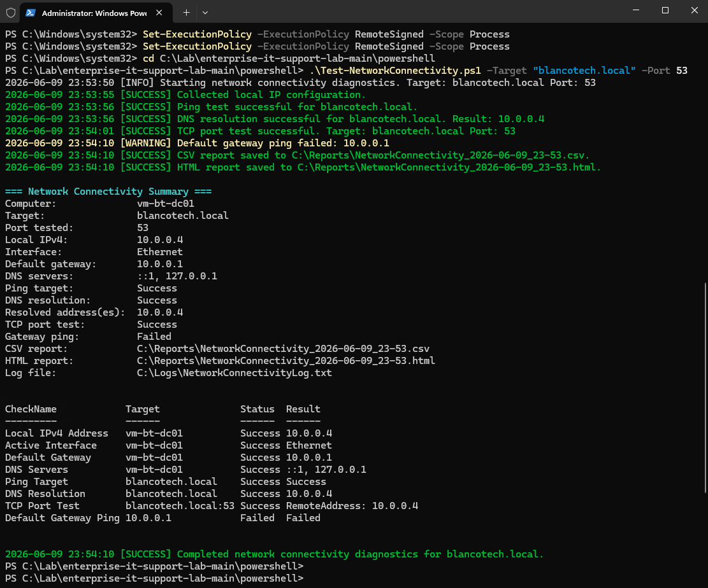

## AD User Report Validation

The AD user report script successfully exported user inventory data.

Results:

| Metric | Result |
|---|---:|
| Total users | 15 |
| Enabled users | 15 |
| Disabled users | 0 |
| Stale users | 15 |
| Locked-out users | 0 |
| Password never expires | 0 |

The 15 stale users result is expected because the lab users have not logged in interactively.

Screenshots:

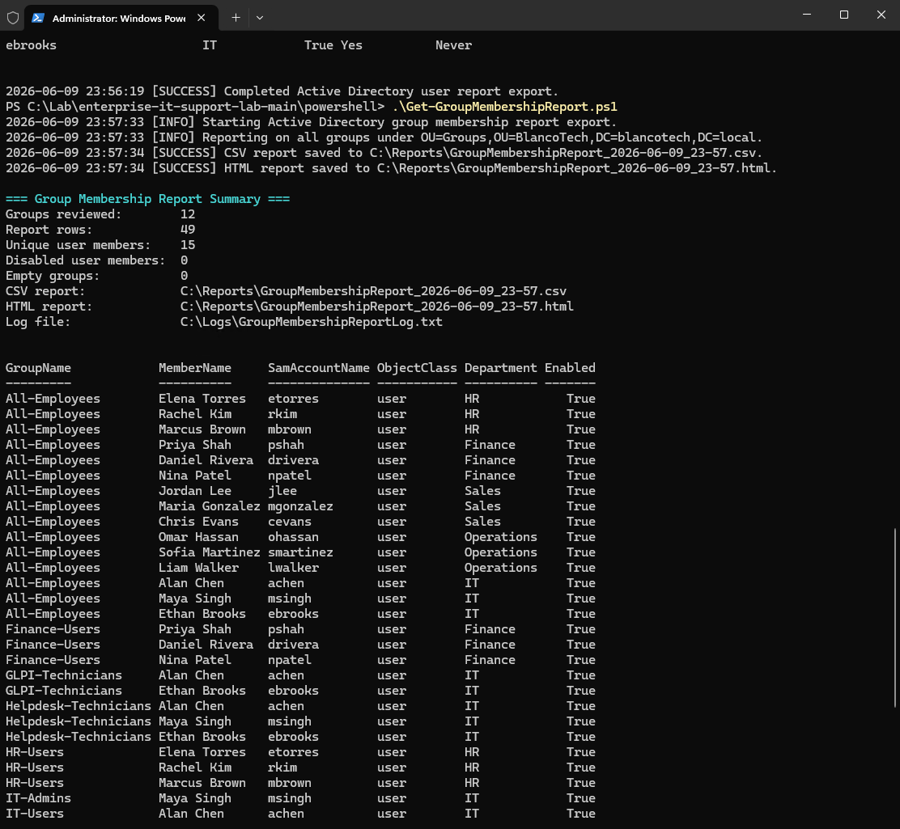

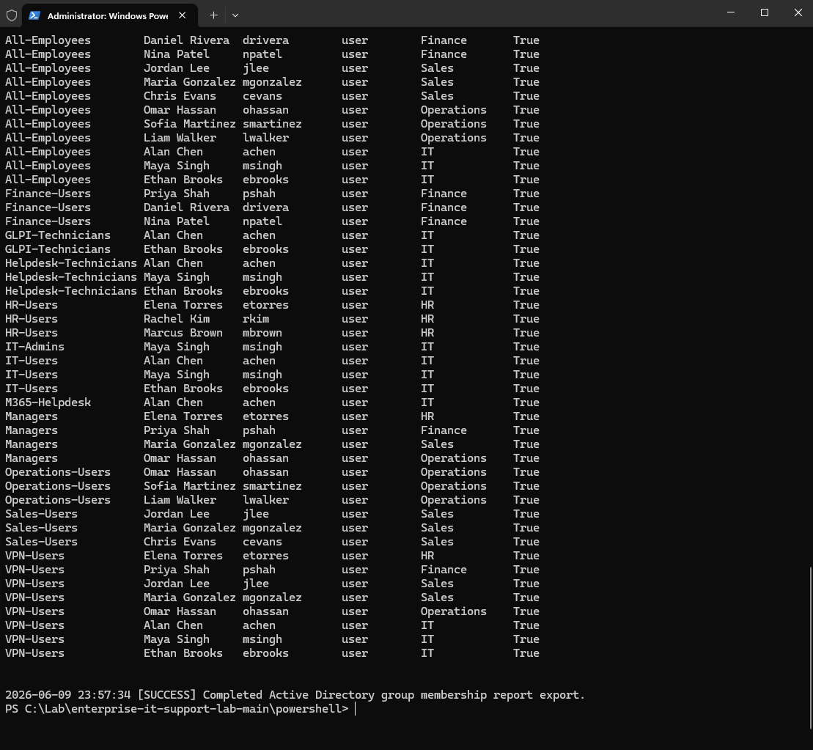

## Group Membership Report Validation

The group membership report script successfully exported group membership data.

Results:

| Metric | Result |
|---|---:|
| Groups reviewed | 12 |
| Report rows | 49 |
| Unique user members | 15 |
| Disabled user members | 0 |
| Empty groups | 0 |

Screenshots:

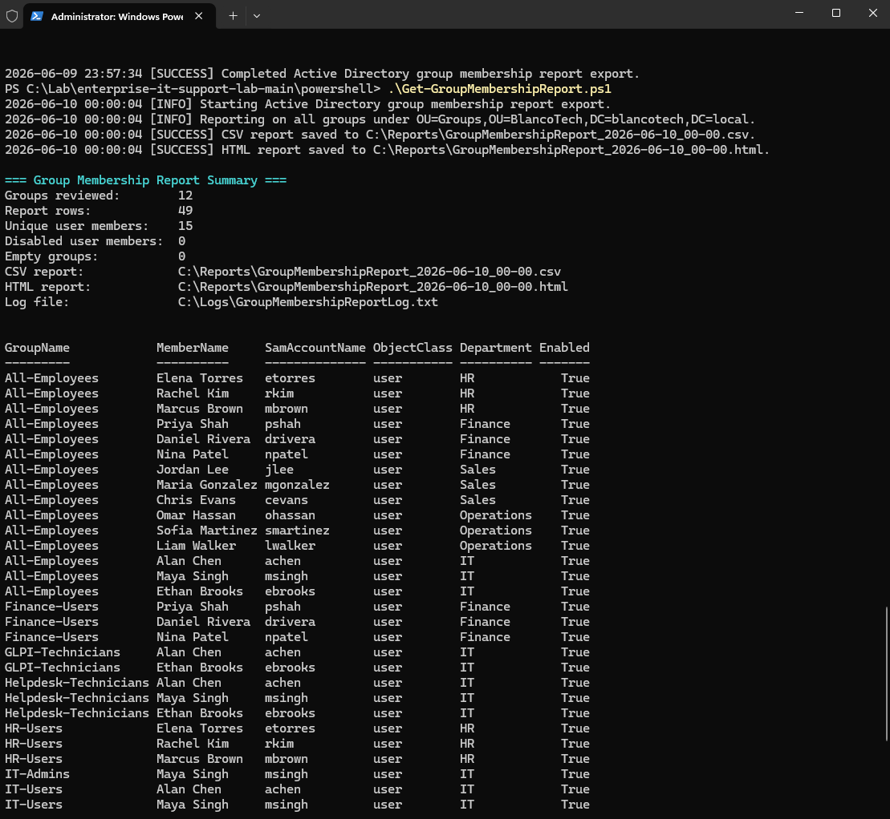

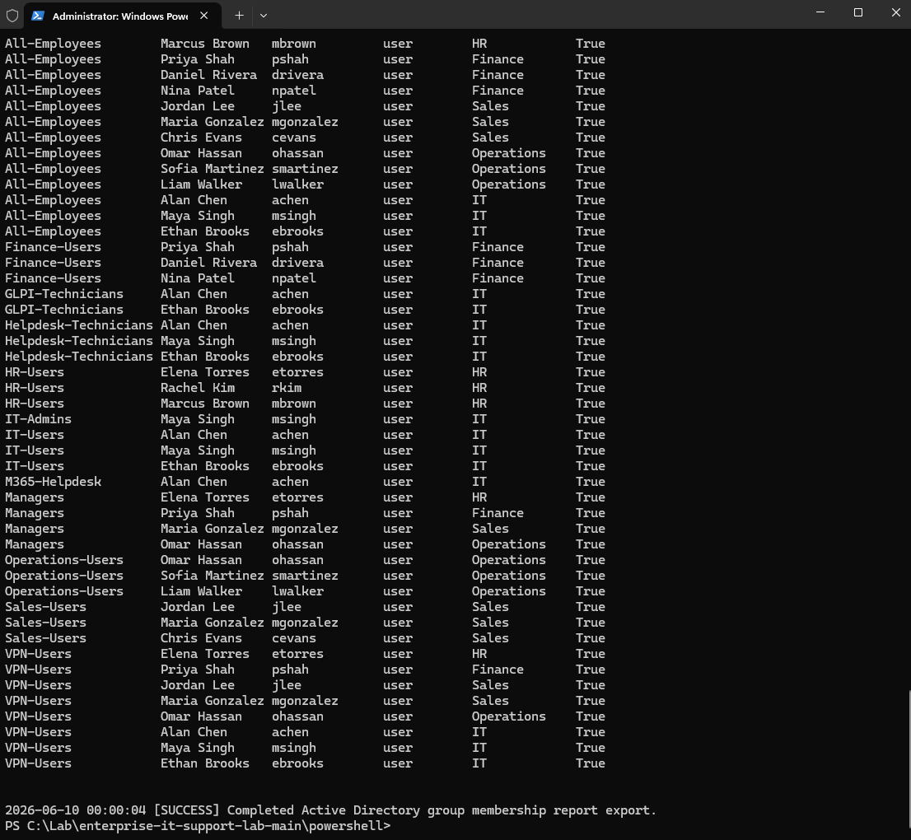

## Locked-Out User Check Validation

The locked-out user script successfully checked Active Directory for locked-out accounts.

Results:

| Metric | Result |
|---|---:|
| Locked-out accounts | 0 |
| CSV report generated | Yes |
| HTML report generated | Yes |
| Log file generated | Yes |

A result of zero locked-out users is expected in a healthy lab environment.

Screenshot:

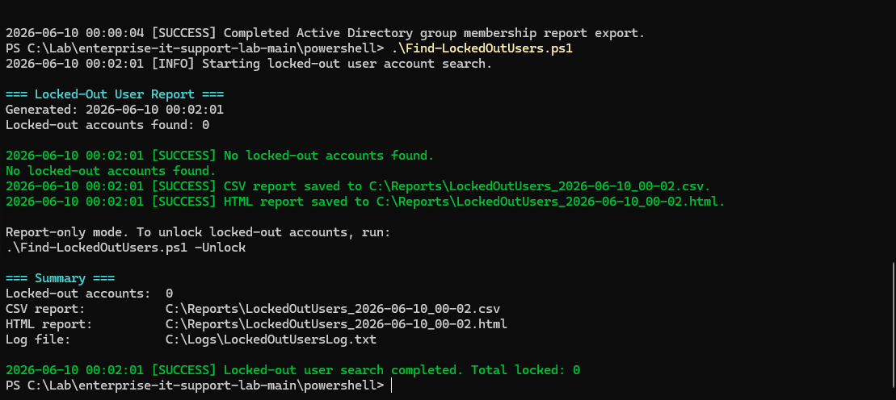

## New Hire Automation Validation

The new hire script successfully created a test user.

Test user:

| Field | Value |
|---|---|
| Name | Carlos Mendez |
| SamAccountName | cmendez |
| UPN | cmendez@blancotech.local |
| Department | Sales |
| Job Title | Sales Representative |
| OU | OU=Sales,OU=Users,OU=BlancoTech,DC=blancotech,DC=local |
| Manager | mgonzalez |
| Password change at next logon | True |

Assigned groups:

- All-Employees
- Domain Users
- Sales-Users
- VPN-Users

Screenshots:

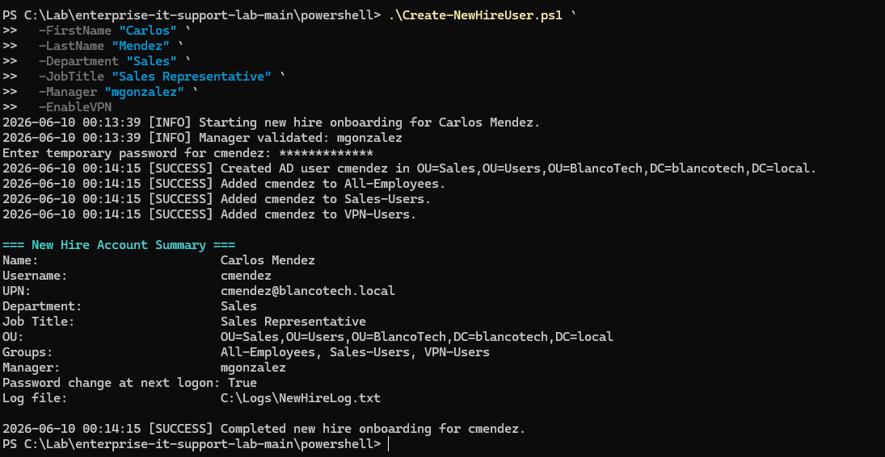

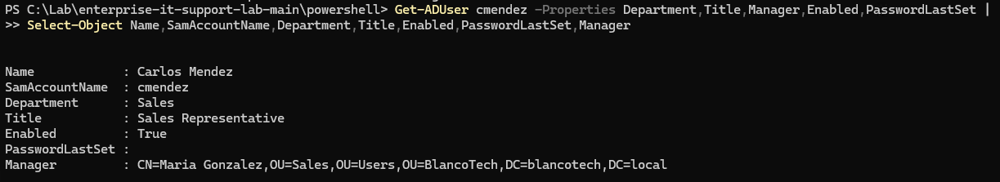

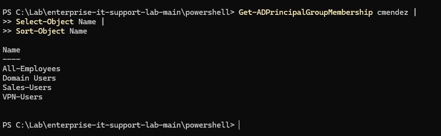

## Offboarding Automation Validation

The offboarding script successfully offboarded the test user `cmendez`.

Actions validated:

- Account disabled
- Removed from `All-Employees`
- Removed from `Sales-Users`
- Removed from `VPN-Users`
- Manager attribute cleared
- Description updated with reason and ticket number
- User moved to Disabled Users OU
- Remaining group: `Domain Users`

Offboarding details:

| Field | Value |
|---|---|
| User | Carlos Mendez |
| SamAccountName | cmendez |
| Reason | Resignation |
| Ticket | INC-1007 |
| Enabled | False |
| Final OU | OU=Disabled Users,OU=BlancoTech,DC=blancotech,DC=local |
| Remaining group | Domain Users |

Screenshots:

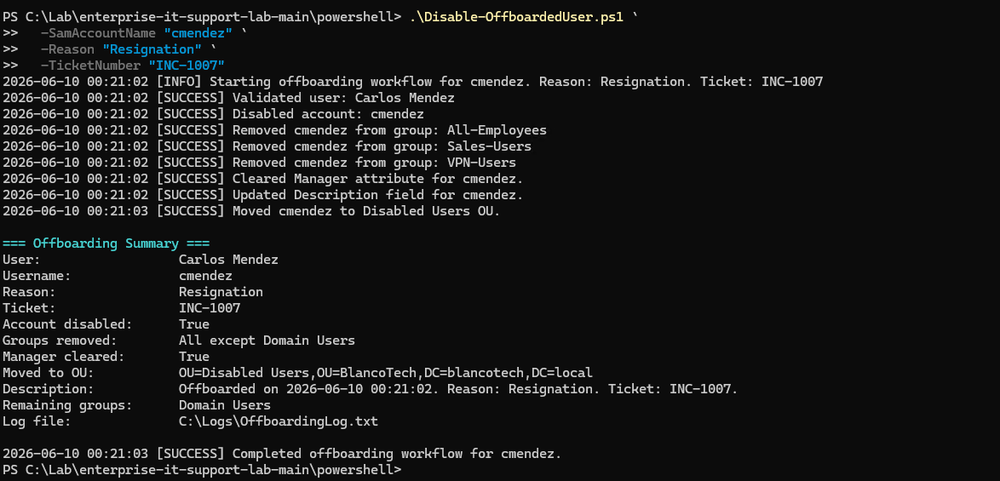

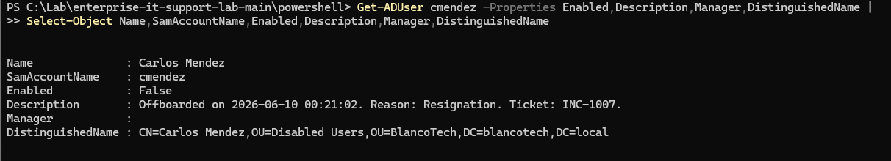

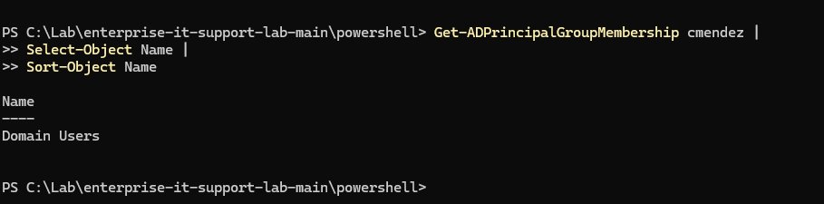

## Final PowerShell Validation Summary

The PowerShell automation phase demonstrates:

- AD user provisioning
- AD user offboarding
- Group membership assignment
- Group membership cleanup
- AD reporting
- Access review reporting
- Locked-out account checks
- Network troubleshooting
- CSV report generation
- HTML report generation
- Logging
- Screenshot-backed validation

## Notes

These scripts are built for a lab environment and should be reviewed before production use.

Production use would require additional controls such as:

- Delegated least-privilege permissions
- Approval workflow integration
- Stronger error handling
- Transcript logging
- Change ticket validation
- Secure credential handling
- Code signing
- Source-controlled release process