# Windows Server Active Directory Lab

## Overview

This section documents the Windows Server and Active Directory portion of the Hybrid Enterprise IT Support & Systems Administration Lab.

The goal is to simulate a traditional business directory environment for BlancoTech Solutions and demonstrate hands-on administration of Active Directory Domain Services, DNS, organizational units, users, groups, access-control structure, password policy, account lockout policy, Group Policy Objects, DNS validation, and basic Active Directory security auditing.

## Environment

| Item | Configuration |
|---|---|
| Cloud Platform | Microsoft Azure |
| Server Name | vm-bt-dc01 |
| Operating System | Windows Server 2025 Datacenter |
| Domain | blancotech.local |
| NetBIOS Name | BLANCOTECH |
| Domain Controller IP | 10.0.0.4 |
| Resource Group | rg-blancotech-ad-lab |
| VM Size | Standard B2als v2 |
| Server Role | Domain Controller, DNS Server |

## Domain Controller Setup

The server was promoted to a domain controller using PowerShell.

Validation commands used:

    Get-ADDomain
    Get-ADDomainController
    Get-WindowsFeature DNS, AD-Domain-Services
    nslookup blancotech.local

Confirmed results:

- Domain created: `blancotech.local`
- NetBIOS name configured: `BLANCOTECH`
- Domain controller: `vm-bt-dc01.blancotech.local`
- AD DS installed
- DNS Server installed
- Domain name resolves to `10.0.0.4`

## Organizational Unit Structure

The following OU structure was created for BlancoTech Solutions:

    BlancoTech
    ├── Users
    │   ├── HR
    │   ├── Finance
    │   ├── Sales
    │   ├── Operations
    │   └── IT
    ├── Groups
    ├── Computers
    ├── Servers
    └── Disabled Users

Accidental deletion protection was enabled on the custom OUs.

Screenshot:

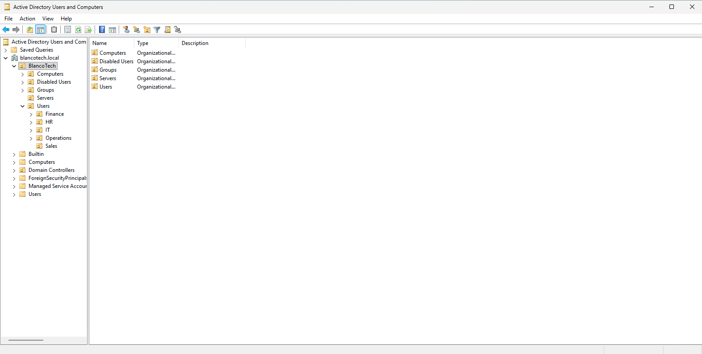

## Security Groups

The following security groups were created:

| Group | Purpose |
|---|---|
| All-Employees | All BlancoTech employees |
| HR-Users | Human Resources department access |
| Finance-Users | Finance department access |
| Sales-Users | Sales department access |
| Operations-Users | Operations department access |
| IT-Users | IT department access |
| Managers | Managers and department leads |
| VPN-Users | Users approved for VPN access |
| IT-Admins | IT administrators with elevated responsibilities |
| Helpdesk-Technicians | Helpdesk technicians for delegated support tasks |
| GLPI-Technicians | IT staff assigned to GLPI ticket handling |
| M365-Helpdesk | Helpdesk users with Microsoft 365 support responsibilities |

Screenshot:

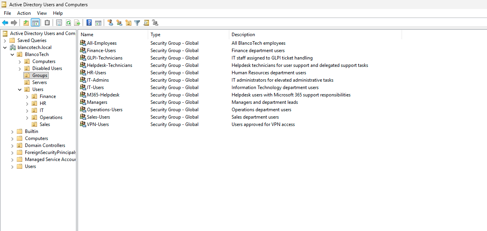

## User Accounts

15 user accounts were created across five departments.

| Department | Users |
|---|---|
| HR | Elena Torres, Rachel Kim, Marcus Brown |
| Finance | Priya Shah, Daniel Rivera, Nina Patel |
| Sales | Jordan Lee, Maria Gonzalez, Chris Evans |
| Operations | Omar Hassan, Sofia Martinez, Liam Walker |
| IT | Alan Chen, Maya Singh, Ethan Brooks |

Each user account includes:

- First name and last name
- Username / SamAccountName
- UserPrincipalName
- Department
- Job title
- Correct department OU placement
- Group-based access assignment
- Enabled account status
- Password change required at next logon

Screenshot:

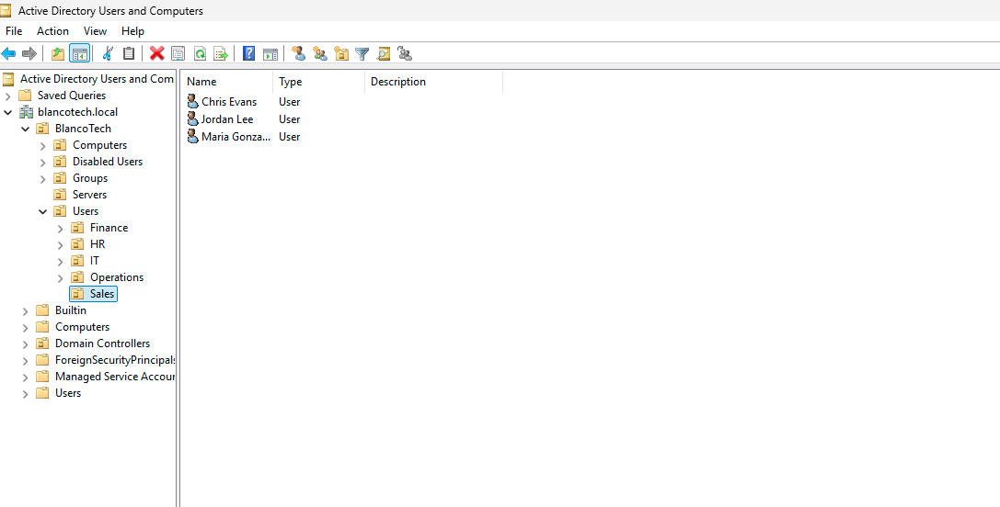

## Group Membership Validation

Group membership was validated with PowerShell.

    Get-ADPrincipalGroupMembership jlee | Select-Object Name | Sort-Object Name

Jordan Lee was confirmed as a member of:

    All-Employees
    Domain Users
    Sales-Users
    VPN-Users

Maya Singh was confirmed as a member of:

    All-Employees
    Domain Users
    Helpdesk-Technicians
    IT-Admins
    IT-Users
    VPN-Users

Alan Chen was confirmed as a member of:

    All-Employees
    Domain Users
    GLPI-Technicians
    Helpdesk-Technicians
    IT-Users
    M365-Helpdesk
    VPN-Users

## Group Count Validation

PowerShell was used to verify group membership counts.

| Group | Member Count |
|---|---:|
| All-Employees | 15 |
| HR-Users | 3 |
| Finance-Users | 3 |
| Sales-Users | 3 |
| Operations-Users | 3 |
| IT-Users | 3 |
| Managers | 4 |
| VPN-Users | 8 |
| IT-Admins | 1 |
| Helpdesk-Technicians | 3 |
| GLPI-Technicians | 2 |
| M365-Helpdesk | 1 |

## Password and Account Lockout Policy

The default domain password policy was configured for BlancoTech users.

| Setting | Value |
|---|---:|
| Minimum password length | 12 characters |
| Password complexity | Enabled |
| Password history | 10 passwords remembered |
| Maximum password age | 90 days |
| Minimum password age | 1 day |
| Account lockout threshold | 5 failed attempts |
| Lockout duration | 15 minutes |
| Lockout observation window | 15 minutes |
| Reversible encryption | Disabled |

Validation command used:

    Get-ADDefaultDomainPasswordPolicy

Screenshot:

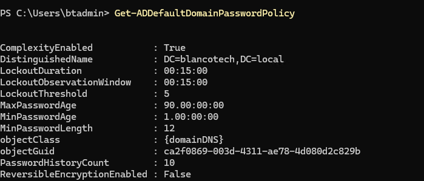

## Group Policy Objects

Three Group Policy Objects were created and linked to the BlancoTech `Users` OU.

| GPO | Purpose |
|---|---|
| GPO - User Screen Lock Policy | Locks user sessions after 15 minutes of inactivity |
| GPO - Block USB Storage | Blocks access to removable storage devices |
| GPO - Map Company Drive | Maps a shared company drive for users |

Validation command used:

    Get-GPO -All | Select-Object DisplayName, GpoStatus | Sort-Object DisplayName

Screenshot:

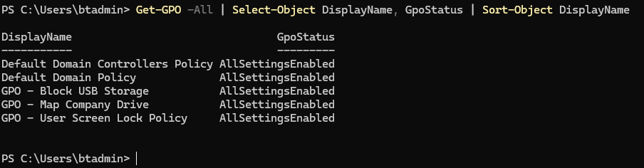

## Linked GPOs

The GPOs were linked to:

    OU=Users,OU=BlancoTech,DC=blancotech,DC=local

Screenshot:

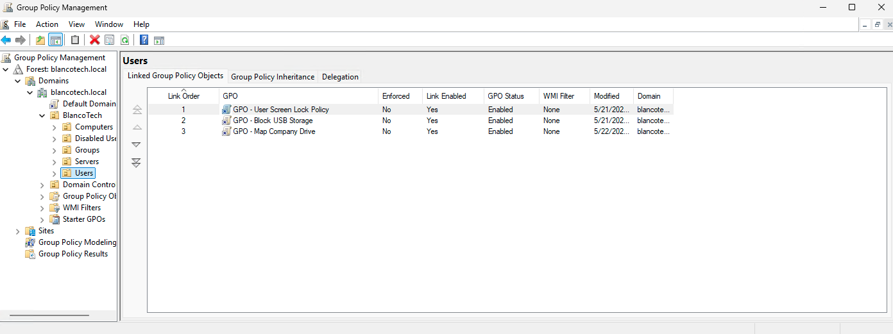

## Screen Lock Policy

The screen lock GPO was configured under:

    User Configuration
    └── Policies
        └── Administrative Templates
            └── Control Panel
                └── Personalization

Configured settings:

| Setting | Value |
|---|---|
| Enable screen saver | Enabled |
| Password protect the screen saver | Enabled |
| Screen saver timeout | 900 seconds |

Screenshot:

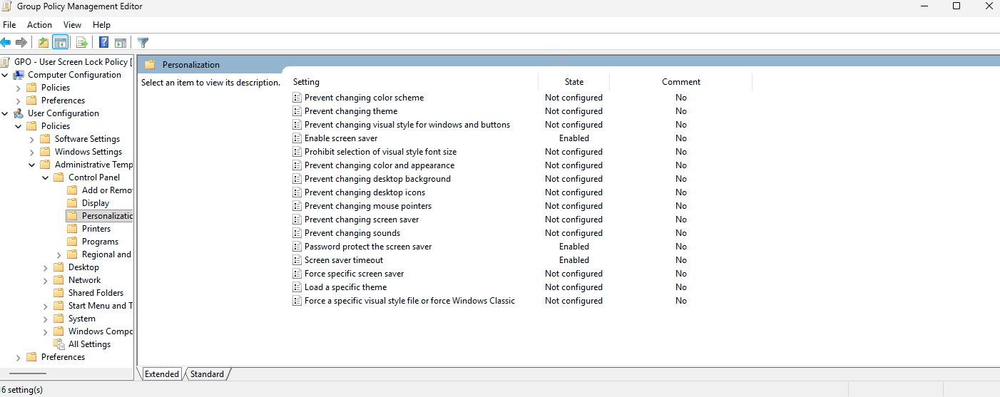

## USB Storage Restriction Policy

The USB storage restriction GPO was configured under:

    User Configuration
    └── Policies
        └── Administrative Templates
            └── System
                └── Removable Storage Access

Configured setting:

| Setting | Value |
|---|---|
| All Removable Storage classes: Deny all access | Enabled |

This blocks users from reading from or writing to removable storage devices such as USB flash drives and external USB hard drives.

Screenshot:

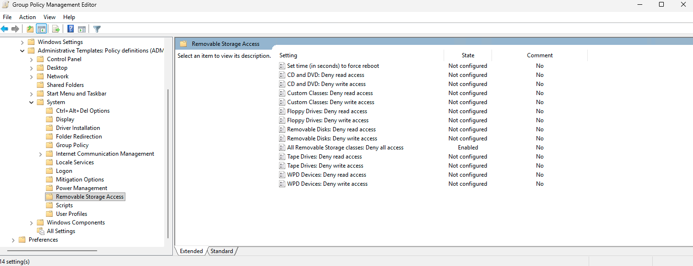

## Mapped Drive Policy

A shared company folder was created and mapped to users through Group Policy Preferences.

Shared folder:

    C:\Shares\Company

Network path:

    \\vm-bt-dc01\Company

Mapped drive configuration:

| Setting | Value |
|---|---|
| Drive letter | S: |
| Location | \\vm-bt-dc01\Company |
| Label | Company Drive |
| Reconnect | Enabled |

Screenshot:

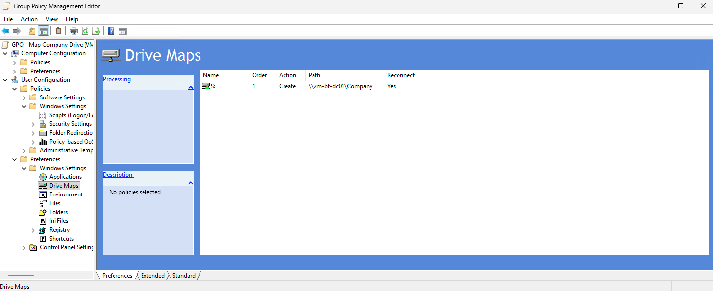

## DNS Configuration and Validation

DNS was installed automatically with Active Directory Domain Services and validated through PowerShell.

Validation commands used:

    Get-WindowsFeature DNS, AD-Domain-Services
    Get-DnsServerZone
    Get-DnsServerResourceRecord -ZoneName "blancotech.local"

Confirmed DNS results:

| Item | Result |
|---|---|
| DNS Server role | Installed |
| AD DS role | Installed |
| Primary domain zone | blancotech.local |
| AD service zone | _msdcs.blancotech.local |
| Domain controller A record | vm-bt-dc01 |
| Domain service records | LDAP, Kerberos, Kpasswd, GC |
| Domain controller IP | 10.0.0.4 |

Screenshot:

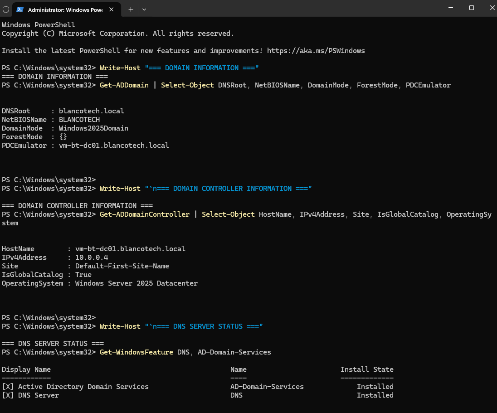

## DNS Zones and Records

The following DNS zones were present on the domain controller:

| Zone | Type | Purpose |
|---|---|---|
| blancotech.local | Primary | Main Active Directory domain zone |
| _msdcs.blancotech.local | Primary | AD domain controller locator records |
| 0.in-addr.arpa | Primary | Reverse lookup zone |
| 127.in-addr.arpa | Primary | Loopback reverse lookup zone |
| 255.in-addr.arpa | Primary | Broadcast reverse lookup zone |

The `blancotech.local` zone includes records required for Active Directory authentication and domain services, including LDAP, Kerberos, Kpasswd, Global Catalog, DomainDnsZones, ForestDnsZones, and the domain controller host record.

Screenshot:

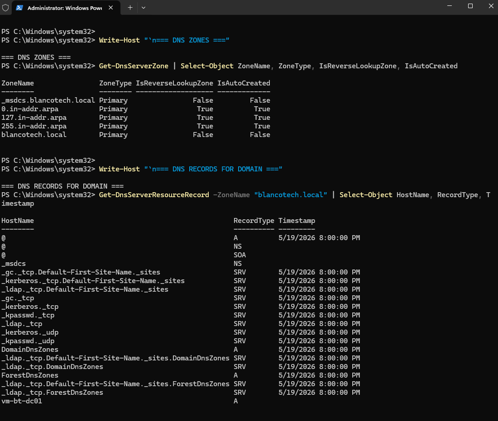

## DHCP Decision

DHCP was not configured on the domain controller for this Azure-based lab.

In this environment, Azure virtual networks provide IP assignment at the platform level. The domain controller uses a static private IP address configured in Azure:

    10.0.0.4

Because this lab is hosted in Azure instead of a traditional on-premises LAN, installing and authorizing the Windows Server DHCP role was not required.

## Privileged Group Audit

Privileged Active Directory groups were reviewed using PowerShell.

Groups reviewed:

| Group | Purpose |
|---|---|
| Domain Admins | Full administrative control over the domain |
| Enterprise Admins | Forest-level administrative control |
| Schema Admins | Schema modification privileges |
| Administrators | Built-in administrative group |
| Account Operators | Delegated account management rights |
| Server Operators | Server-level administrative operations |
| Backup Operators | Backup and restore privileges |

Validation command used:

    Get-ADGroupMember

Audit notes:

- Privileged group membership was reviewed.
- Default administrative relationships were present.
- The lab administrator account was visible in privileged access review output.
- No unnecessary standard user accounts were added to privileged groups.

Screenshot:

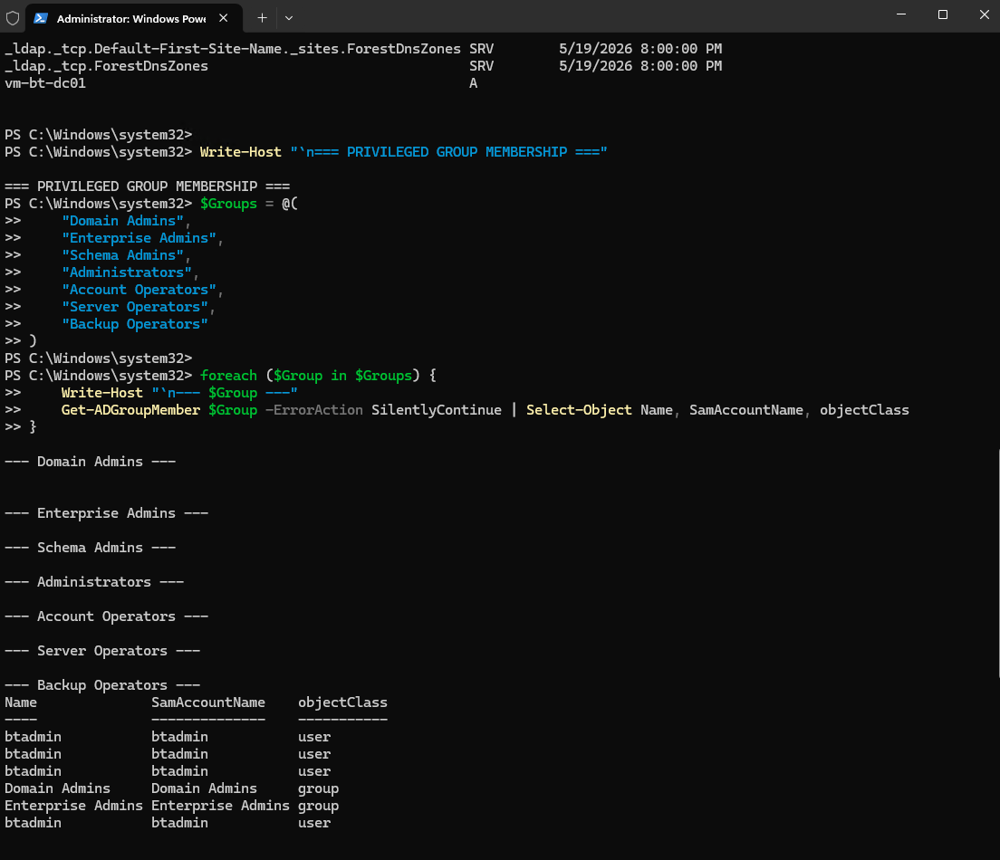

## User Security Audit

Basic user account security checks were performed with PowerShell.

Checks performed:

| Check | Result |
|---|---|
| Disabled users | Guest and krbtgt were disabled |
| Enabled users with PasswordNeverExpires | None found |
| Enabled users that cannot change password | None found |
| Locked-out users | None found |

Validation commands used:

    Get-ADUser -Filter {Enabled -eq $false}
    Get-ADUser -Filter {Enabled -eq $true -and PasswordNeverExpires -eq $true}
    Get-ADUser -Filter {Enabled -eq $true} -Properties CannotChangePassword
    Search-ADAccount -LockedOut

Security interpretation:

- Disabled default accounts were present as expected.
- No enabled users were configured with passwords that never expire.
- No enabled users were prevented from changing passwords.
- No user accounts were locked out at the time of the audit.

Screenshot:

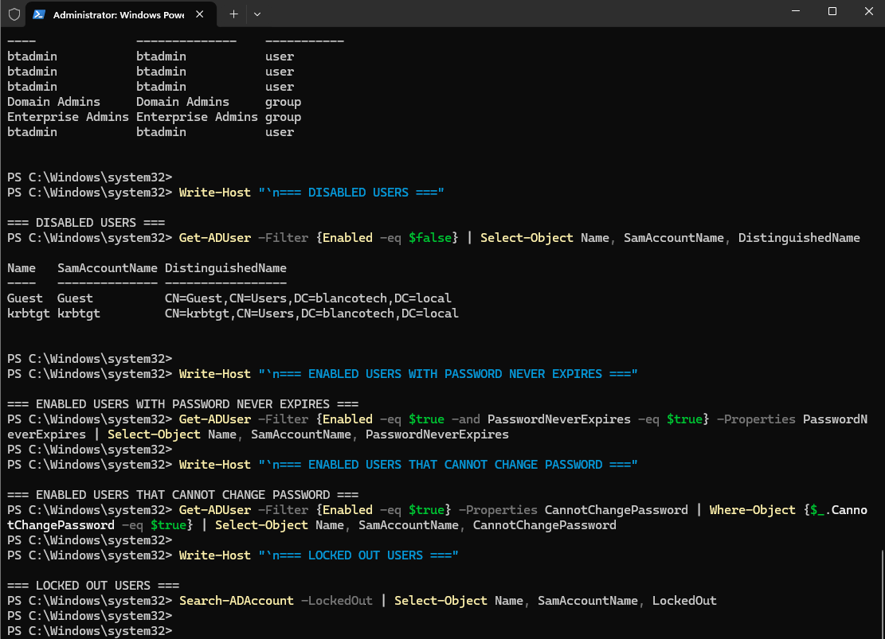

## Skills Demonstrated

- Azure Windows Server VM deployment
- Active Directory Domain Services installation
- Domain controller promotion
- DNS role installation and validation
- Static private IP configuration
- OU design
- Department-based user organization
- Security group creation
- Group-based access control
- PowerShell-based user creation
- PowerShell-based validation
- Default domain password policy configuration
- Account lockout policy configuration
- Group Policy Object creation and linking
- Screen lock enforcement through GPO
- Removable storage restriction through GPO
- Mapped drive deployment through Group Policy Preferences
- SMB share creation for company drive mapping
- DNS zone validation
- DNS record validation
- DHCP decision documentation for Azure environment
- Privileged group review
- User account security auditing
- Screenshot-backed technical documentation

## Next Improvements

Planned additions:

- Delegated password reset permissions
- AD security audit findings
- PowerShell automation scripts for onboarding and offboarding

